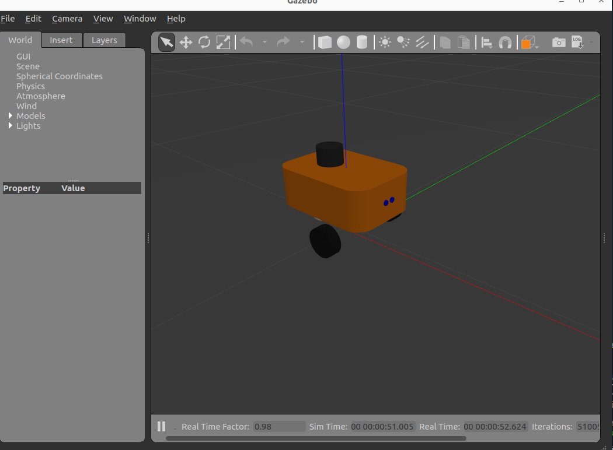
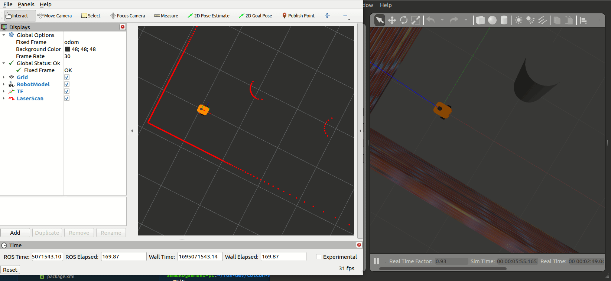

# mobo_bot

> NOTE: development is done in ros2-humble.

clone (git clone git@github.com:samuko-things/mobo_bot.git) or Download
the repo or in your ROS2 workspace, build all packages, and source it.

```shell
colcon build --packages-select mobo_bot_description --symlink-install
```

## Basic Launch

**to view robot in RVIZ:**


```shell
$ ros2 launch mobo_bot_description rviz.launch.py
```

**to spawn robot in gazebo:**



```shell
$ ros2 launch mobo_bot_description sim.launch.py
```

**to spawn robot in gazebo and view in RVIZ simultaneously:**



```shell
$ ros2 launch mobo_bot_description sim_and_rviz.launch.py
```
---
you can drive it around using the teleop_twist_keyboard package or you can
also use the [pynput_teleop_twist_keyboard](https://github.com/samuko-things/pynput_teleop_twist_keyboard/tree/humble_dev) package I wrote.

after building the package, run:
```shell
$ ros2 run pynput_teleop_twist_keyboard pynput_teleop_twist_keyboard 0.2 0.6
```
drive the robot easily using the arrow keys

---