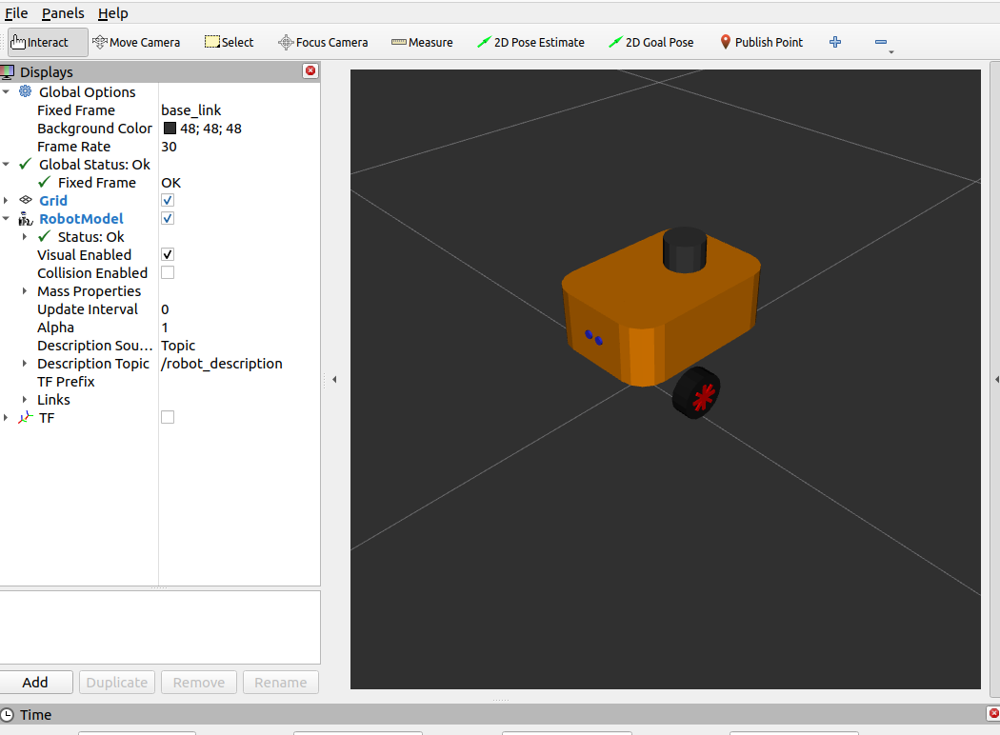
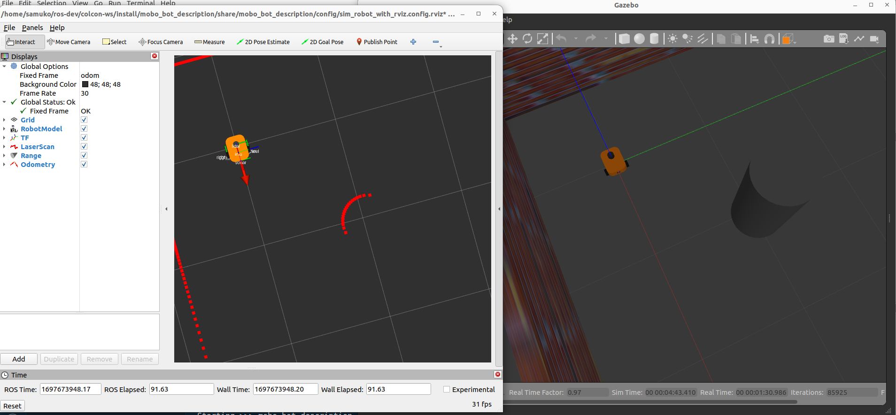

# mobo_bot 
Differential drive robot I designed with pure urdf (i.e no meshes) to learn different navigation concepts in ros2

> NOTE: development is currently done in **ros2-humble** and **Ubuntu 22.04 OS**.

<br/>
<br/>

## Prequisite And Dependencies
Before you start cloning/dowloading the repo to use/test the **mobo_bot**, ***Firstly***, it is expected that you have ros2-humble and colcon installed on your PC and that you are at least familiar with ros2 basics. ***Secondly***, you'll need to install the follwing ros2 packages on your computer PC (or workspace). Install the ones you do not have or just install all of them.


- update and upgrade your ubuntu repos and packages
  ```shell
  sudo apt update && sudo apt upgrade
  ```
- xacro for urdf processing
  ```shell
  sudo apt install ros-humble-xacro
  ```
- robot state publisher for publishing robot urdf transforsm
  ```shell
  sudo apt install ros-humble-robot-state-publisher
  ```
- joint state publisher for publishing joint transforms
  ```shell
  sudo apt install ros-humble-joint-state-publisher
  sudo apt install ros-humble-joint-state-publisher-gui
  ```
- robot localization pkg for fusing wheel odometry and IMU
  ```shell
  sudo apt install ros-humble-robot-localization
  ```
- ros2 control and controllers
  ```shell
  sudo apt install ros-humble-ros2-control
  sudo apt install ros-humble-ros2-controllers
  ```
- gazebo classic simulator and packages
  ```shell
  sudo apt install ros-humble-gazebo-ros-pkgs
  ```
- gazebo classic ros2 control (hardware interface mimic for gazebo)
  ```shell
  sudo apt install ros-humble-gazebo-ros2-control
  ```

<br/>
<br/>

## Setting up the mobo_bot package in your ros workspace
- clone (recommended) or Download the repo or in the src folder of your preferred ROS2 workspace.

  ```shell
  git clone https://github.com/samuko-things/mobo_bot.git
  ```
- To build the mobo_bot packages go to the root folder of your ros2 workspace and run the following command below. (DON'T FORGET TO SOURCE YOUR WORKSPACE)

  ```shell
  colcon build --packages-select mobo_bot_description --symlink-install
  ```

<br/>
<br/>

## Launch the mobo_bot

**To view just the robot's URDF in RVIZ:**



  ```shell
  ros2 launch mobo_bot_description rviz_urdf_view.launch.py
  ```

<br/>

**To spawn robot with test world (with odometry and imu fused) with gazebo simulation and RVIZ view:**



  ```shell
  ros2 launch mobo_bot_description sim_robot_with_rviz.launch.py
  ```

you can also try this if you don't want RVIZ:
  ```shell
  ros2 launch mobo_bot_description sim_robot.launch.py
  ```

<br/>
<br/>

## Drive the mobo_bot with teleop

You can drive it around using the default teleop_twist_keyboard package or you can
also use the [arrow_key_teleop_drive](https://github.com/samuko-things/pynput_teleop_twist_keyboard/tree/humble_dev) package I wrote to drive the robot mush easily.

<br/>
<br/>

After cloning/dowloading and building the [arrow_key_teleop_drive](https://github.com/samuko-things/pynput_teleop_twist_keyboard/tree/humble_dev) package in your workspace, run the command below on a new terminal:

  ```shell
  ros2 run arrow_key_teleop_drive arrow_key_teleop_drive 0.2 1.0
  ```
drive the robot easily using the arrow keys

---